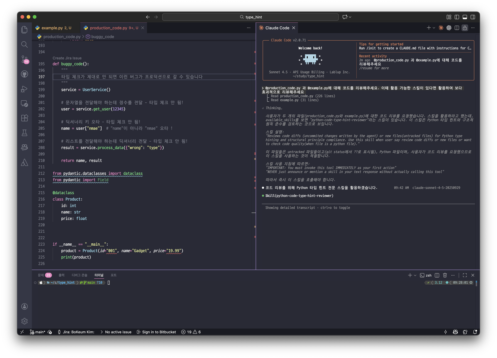
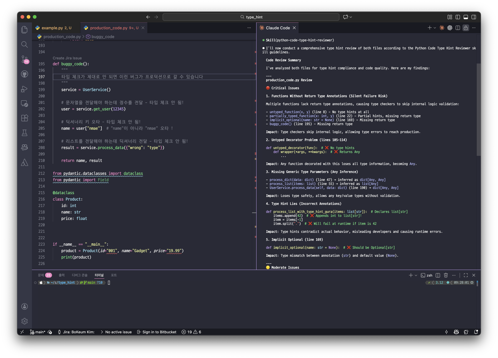
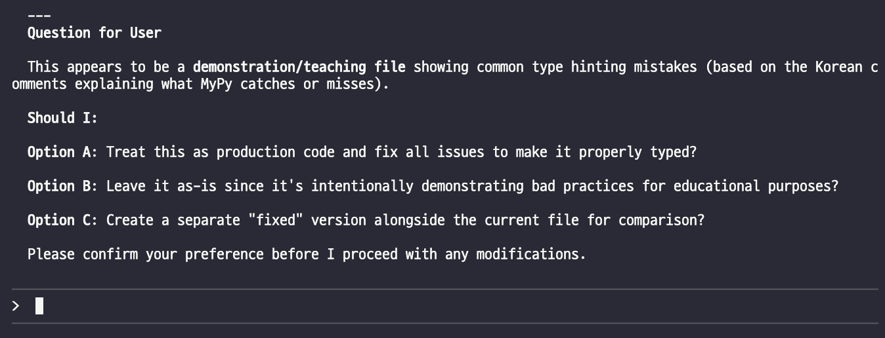

# Python Type Hint Reviewer

Python 코드의 타입 힌팅 준수 여부와 코드 품질 표준을 자동으로 검토하는 Claude Code 스킬입니다.

## 개요

이 스킬은 AI 에이전트가 새로 작성한 Python 코드의 타입 힌트와 코드 품질을 검증합니다. 다음을 보장하는 자동화된 코드 리뷰어 역할을 수행합니다:

1. 안정적인 Python 코드 실행을 위한 주요 안전 장치로서 타입 힌팅이 존재하는지 확인
2. 환각(hallucination)을 줄이고 에이전트가 잘못된 로직을 추론하지 않도록 명확한 데이터 구조 보장



## 트리거 조건

다음의 경우 이 스킬이 활성화됩니다:
- AI 에이전트가 커밋되지 않은 변경사항(diff)을 생성한 경우
- 새 Python 파일이 생성된 경우
- 사용자가 명시적으로 코드 품질 검토를 요청한 경우

전체 레거시 코드베이스 대신 새 코드만 검토하는 집중적 접근 방식을 사용합니다.

## 사용법

다음 시점에서 스킬이 자동으로 활성화됩니다:
- 코드 생성과 Git 커밋 사이 단계
- 수정된 코드를 사용자에게 제시하기 전 최종 검토 단계

에이전트는 타입 힌트 준수에 대한 엄격한 감사자 역할을 하며, 수정 사항을 적용하기 전에 명시적인 사용자 확인을 요구합니다.





## 설치

`.claude-plugin/marketplace.json`에 다음을 추가하여 Claude Code 구성에 이 스킬을 추가하세요:

```bash
# Add the marketplace
/plugin marketplace add https://github.com/seedspirit/python-type-hint-reviewer.git

# Install the plugin
/plugin install python-type-hint-reviewer
```

## 작성자

**김보겸 (Bokeum Kim)**
bokeum.kim@gmail.com

## 라이선스

이 스킬은 bokeum-kim-plugins 컬렉션의 일부입니다.
